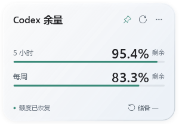
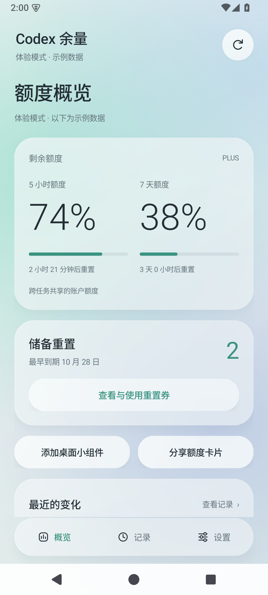

# Codex 余量 · Codex Quota

液态玻璃风格的 Codex 账户用量工具。查看剩余额度，在需要时使用储备重置券，让一小块玻璃留在桌面。

Native Windows and Android clients for Codex account quotas, banked resets, and desktop widgets. Independently developed; not an official OpenAI product.

**[下载安装文件](https://github.com/430284565hzm-beep/codex-quota/releases/latest)** · [构建说明](docs/BUILDING.md) · [账户协议](android/PROTOCOL.md) · [隐私说明](docs/PRIVACY.md)

<p>
  
  
</p>

截图使用示例数据。

## 能做什么

- 显示两个账户额度窗口、剩余百分比、重置时间和可用重置券。
- Windows 浮动桌面组件，连续圆角、背景模糊和半透明材料，不占任务栏。靠近左右边缘时胶囊上下排列，靠近上边缘时左右排列。
- Android 原生应用，通过系统浏览器登录 ChatGPT；提供卡片和胶囊两种桌面小组件。
- 小组件可以直接刷新；后台自动同步、低额度与到期提醒、最近 7 天的本机额度记录。
- 确认兑换后重新读取真实余额，两条原有额度条用约 1.2 秒平稳恢复。扩散光环、彩纸礼炮和原创短音效；彩纸和音效可分别关闭。
- 提供体验模式，不消耗真实重置券。

正常刷新不会发起模型推理。兑换仅在用户点击确认后提交；不确定的兑换结果使用原请求编号重试，避免重复扣券。

## 下载与运行

| 平台 | 发布文件 | 当前版本 | 运行条件 |
| --- | --- | --- | --- |
| Windows | `CodexQuota-Windows.exe` | 1.4.0 | Windows 10/11、.NET Framework 4.8、当前账户已安装并登录 Codex |
| Android | `CodexQuota-Android.apk` | 1.3.0 | Android 8.0 / API 26 及以上，可以访问 OpenAI 账户服务 |

Windows 双击 EXE 即可运行，不需要打开终端。手机安装 APK 后，点击「继续使用 ChatGPT」，在 OpenAI 官方浏览器页面完成授权。应用包名保持 `dev.codex.glass`，以兼容此前的安装更新。

详细使用说明：[Windows](windows/README.md) · [Android](android/README.md)。三星 One UI 的后台设置见 Android 说明中的 S22+ 部分。

## 材料与平台边界

Windows 使用原生 WPF 和 Win32，手机使用原生 Android Java / Canvas。动画在平台本身的动画系统中运行，保留现有玻璃材料。

Android 桌面小组件由系统桌面通过 RemoteViews 渲染，无法实时模糊身后的壁纸。可以选择同一张壁纸作为材料背景，使用预先模糊的纹理；自动同步也可能被系统省电策略延后。这些功能不使用屏幕录制或绕过壁纸权限。

## 源码结构

```text
android/                 Android 应用、桌面小组件、构建脚本与模拟账户测试
windows/                 WPF 组件、便携 EXE 宿主、构建脚本与协议测试
docs/                    构建、隐私、验证说明及示例截图
LICENSE                  Apache-2.0
NOTICE                   版权与上游来源
```

构建工具从官方来源单独下载并校验；本仓库不包含 SDK、Codex 可执行文件、登录凭据或发行签名私钥。编译方法和签名说明见 [BUILDING.md](docs/BUILDING.md)。

## 验证

发布前使用模拟账户验证了登录身份检查、兑换重试、重复提交、两个额度条、动画收尾、小组件布局和无需打开应用的桌面刷新。Windows 验证了 18 组尺寸与主题组合、边缘收起、非满额服务器返回值及小数精度。验证过程没有消耗真实重置券。

测试范围和命令见 [VERIFICATION.md](docs/VERIFICATION.md)。三星 S22+ 的实机后台调度尚未自动验证。

## 协议与许可证

账户登录和额度接口依据 OpenAI Codex 的开源实现。使用的是个人 Codex 客户端账户流程；这些接口可能随上游更新，并非稳定的第三方 Android API 承诺。相关实现、来源和边界记录在 [PROTOCOL.md](android/PROTOCOL.md)。

本项目采用 [Apache License 2.0](LICENSE)。上游 OpenAI Codex 的版权与许可证保留在 [NOTICE](NOTICE) 和 [第三方说明](android/THIRD_PARTY_NOTICES.md) 中。
